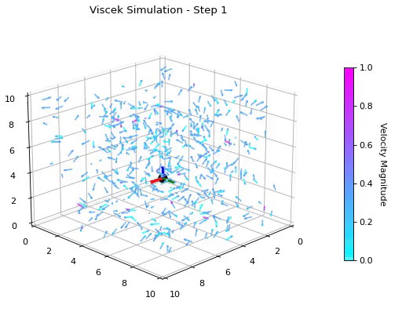

# Viscek model simulation in 3D

The Vicsek model simulates the collective behavior of particles in space, where each particle moves with a constant speed and interacts with its neighbors within a specified radius, leading to emergent swarming patterns. The simulation captures the dynamics of self-propelling agents influenced by random fluctuations in direction, demonstrates the complex behaviors characteristic of active matter systems.

References

https://github.com/pmocz/activematter-python
https://en.wikipedia.org/wiki/Vicsek_model
https://arxiv.org/pdf/cond-mat/0611743